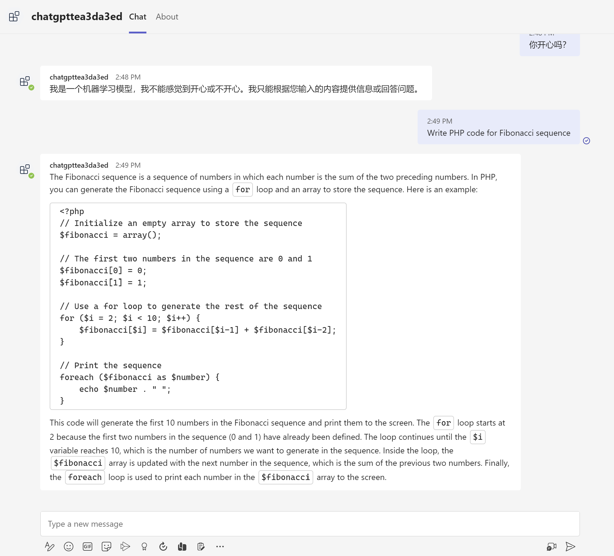

# How to use this ChatGPT Teams Bot app

This is a ChatGPT Teams Bot app to let you chat with ChatGPT in Microsoft Teams.

You could also try the [ChatGPT WeChat Bot](https://github.com/formulahendry/chatgpt-wechat-bot).



## Prerequisites

- An [OpenAI](https://openai.com/api/) account
- [NodeJS](https://nodejs.org/en/) (Tested on Node.js 18.12.1)
- An M365 account. If you do not have M365 account, apply one from [M365 developer program](https://developer.microsoft.com/en-us/microsoft-365/dev-program)
- Latest stable version of [Teams Toolkit Visual Studio Code Extension](https://aka.ms/teams-toolkit) (Tested on version 4.1.3)

## Get API key

Get an OpenAI API key from https://beta.openai.com/account/api-keys.

## Debug

- Create a `.env.teamsfx.local` file under `bot` folder, and set the OpenAI API key in `.env.teamsfx.local` file:
    ```
    OPENAI_API_KEY=xxxxxxxxxx
    ```
- From Visual Studio Code: Start debugging the project by hitting the `F5` key in Visual Studio Code. 
- Alternatively use the `Run and Debug Activity Panel` in Visual Studio Code and click the `Run and Debug` green arrow button.
- From TeamsFx CLI: Start debugging the project by executing the command `teamsfx preview --local` in your project directory.

## Deploy to Azure

First, set `OPENAI_API_KEY` in envionment variables of your OS.

Then, deploy your project to Azure by following these steps:

| From Visual Studio Code                                                                                                                                                                                                                                                                                                                                                  | From TeamsFx CLI                                                                                                                                                                                                                    |
| :----------------------------------------------------------------------------------------------------------------------------------------------------------------------------------------------------------------------------------------------------------------------------------------------------------------------------------------------------------------------- | :---------------------------------------------------------------------------------------------------------------------------------------------------------------------------------------------------------------------------------- |
| <ul><li>Open Teams Toolkit, and sign into Azure by clicking the `Sign in to Azure` under the `ACCOUNTS` section from sidebar.</li> <li>After you signed in, select a subscription under your account.</li><li>Open the Teams Toolkit and click `Provision in the cloud` from DEPLOYMENT section or open the command palette and select: `Teams: Provision in the cloud`.</li><li>Open the Teams Toolkit and click `Deploy to the cloud` or open the command palette and select: `Teams: Deploy to the cloud`.</li></ul> | <ul> <li>Run command `teamsfx account login azure`.</li> <li>Run command `teamsfx account set --subscription <your-subscription-id>`.</li> <li> Run command `teamsfx provision`.</li> <li>Run command: `teamsfx deploy`. </li></ul> |

> Note: Provisioning and deployment may incur charges to your Azure Subscription.

## Preview

Once the provisioning and deployment steps are finished, you can preview your app:

- From Visual Studio Code

  1. Open the `Run and Debug Activity Panel`.
  1. Select `Launch Remote (Edge)` or `Launch Remote (Chrome)` from the launch configuration drop-down.
  1. Press the Play (green arrow) button to launch your app - now running remotely from Azure.

- From TeamsFx CLI: execute `teamsfx preview --remote` in your project directory to launch your application.

## Further reading

- [chatgpt-api Node SDK](https://github.com/transitive-bullshit/chatgpt-api): it is a 3rd-party ChatGPT npm used in this Teams bot. 
